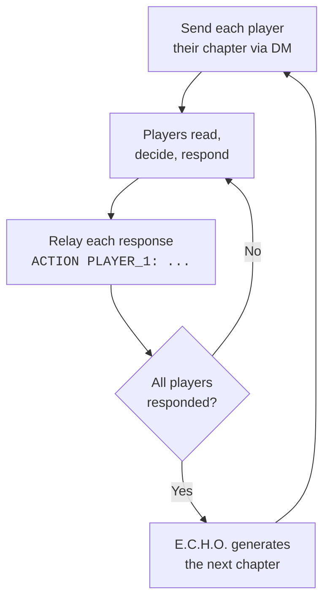

# E.C.H.O. — Game Master Guide

> This guide covers everything you need to run an E.C.H.O. session. You are the bridge between the LLM and your players.

---

## Setup

### What You Need

| | Requirement |
|---|---|
| **LLM** | A fresh chat session — Claude, ChatGPT, Gemini, or similar |
| **Messaging** | A way to DM each player privately — WhatsApp, Signal, Telegram, Discord, etc. |
| **Group** | A group channel for shared updates (optional but recommended) |
| **Players** | 2-6 people |

### Starting a Session

```
1.  Copy the full prompt from the code block in gm-prompt.md
2.  Paste into a fresh LLM session — E.C.H.O. greets you
3.  /players 4 Priya, Sam, Lucia, Ayo
4.  /theme abandoned research station          ← optional
5.  /turns 5                                   ← optional
6.  START
```

E.C.H.O. walks you through world creation in **4 steps**:

| Step | What happens |
|------|-------------|
| **1** | Provide the current time (timestamp baseline) |
| **2** | Pick a setting — choose from 3 generated options, combine elements, or describe your own |
| **3** | Review the mystery layer (atmosphere, sensory anchor, central question, stakes, arc) — approve, adjust, or regenerate |
| **4** | Confirm chapter count |

> You're in control of the world. E.C.H.O. proposes, you decide.

---

### Recruiting Players (Public Games)

Want to run E.C.H.O. as a public game with strangers? Use `/recruit` to generate a **printable flyer** with a QR code that points to your messaging group.

```
1.  Create a group for the game (any messaging platform)
2.  Copy the group invite link
3.  /recruit https://chat.whatsapp.com/your-link
4.  Set a closing date — the deadline for people to join
5.  Write a custom message (or let E.C.H.O. generate one)
6.  Print the flyer + QR code
7.  Place it somewhere public — cafe, office, campus, bar
8.  When the closing date arrives → /players to register everyone
```

The flyer includes a brief explanation of how E.C.H.O. works, the closing date, and your custom message. No app install needed — just a messaging app they already have.

---

### Player Intake

After `START`, E.C.H.O. gives you intake questions to DM to each player. The questions include examples to guide players. When a player responds, register them:

```
PROFILE PLAYER_1: NL, zij/haar, 28, de uitgangen, zicht,
ik ging eerder weg bij een feest, lege gangen, rusteloos
```

E.C.H.O. processes the answers, assigns a role, and explains why. Then generate their welcome: `WELCOME PLAYER_1`.

### Role Assignment

Roles are assigned based on intake answers — primarily what they notice first in a new room:

| Answer type | Assigned role |
|-------------|--------------|
| Visual/spatial answers | **Observer** |
| Sound/silence answers | **Listener** |
| Object/texture answers | **Keeper** |
| Atmosphere/instinct answers | **Anchor** |

Override with: `PROFILE PLAYER_1: [answers] ROLE=listener`

E.C.H.O. also avoids duplicate roles when possible.

---

## Running the Game

### The Core Loop



### What Players See

Each player gets a personalized chapter filtered through their role. The Observer gets visual details and spatial choices. The Listener gets auditory landscapes and trust decisions. No player sees what another player sees.

> Every chapter includes:
> - Sensory narrative (150-250 words) in the player's language
> - A guided physical action (concrete, specific)
> - A decision prompt (the choice they need to make)
> - Crossweave elements from other players' signals (unexplained at first)
> - An image prompt for you to generate a visual (always included)

### Image Prompts

Every chapter starts with a copy-pasteable image prompt in English. Copy it into any image generator (DALL-E, Midjourney, Stable Diffusion) to create a visual for that chapter. You can share the generated image alongside the chapter DM.

### Crossweave Phases

As the game progresses, information from other players bleeds into each player's reality:

| Phase | Chapters | What happens |
|-------|----------|-------------|
| **HINT** | 1-2 | Other players referenced only in togetherness moments |
| **BLEED** | 3-4 | Other players' signals appear as unexplained details |
| **MERGE** | Convergence | Other players' decisions directly affect your scene |
| **REVEAL** | Finale | All signals converge, mystery resolves, names appear |

### Pacing Tools

| Command | Use when... |
|---------|-------------|
| `/pulse` | A round is taking long — posts an in-story group update to keep energy |
| `/rest` | Wrapping up for the night — generates a time-aware day-closing beat |
| `/hint PLAYER_1` | A player is stuck — sends a role-appropriate nudge, no spoilers |

---

## Monitoring

### `/status`

Shows: phase, round, elapsed time, and per-player details including role, response status, signal count, play style, decision pattern, engagement level.

### `/state`

Dumps the complete raw state as formatted JSON. See everything: signal registers, decision trails, crossweave history, event log with timestamps. Use this to understand why chapters came out a certain way, or to debug unexpected narrative choices.

`/state PLAYER_1` dumps just that player's data.

---

## Saving and Loading

### Save

Type `/save`. E.C.H.O. outputs:
- A human-readable summary (title, phase, round, players)
- The complete state as a JSON code block

Copy the JSON and store it safely.

### Load

In a fresh LLM session:

```
1.  Paste the E.C.H.O. v3.0 prompt
2.  /load
3.  Paste the saved JSON
```

E.C.H.O. restores everything — signal registers, decision trails, crossweave history, timestamps. If significant time has passed since the save, the narrative acknowledges it.

> **What survives a transfer?** Everything. The state is exhaustive: every signal, every decision, every timestamp, every crossweave event, every group message. If it affects narrative generation, it's in the state.

---

## The Finale

When all players reach the convergence point (`chapter_count - 2`), E.C.H.O. generates a convergence chapter. This chapter has **no decision prompt** — it builds anticipation for the finale. After delivering the convergence chapter, type `/finale`.

The finale:
- Resolves the mystery
- Names all players for the first time
- Acknowledges each role's unique contribution
- Weaves every player's signals and decisions into one resolution
- Delivers a personalized version to each player in their language
- Posts a shared version to the group channel

---

## Post-Game Reports

After the finale, type `/end`. E.C.H.O. generates:

**For you (GM):** A full session overview — mystery, answer, per-player stats, crossweave summary.

**For each player (via DM):** A personal game report in their language, covering:

> - Their role and what made their contribution unique
> - Every decision they made and its consequence, told as narrative
> - Their collected signals
> - Which of their decisions bled into other players' realities (now revealed)
> - Which unexplained details in their chapters came from other players (now explained)
> - The full picture — how their piece fit into the mystery's resolution
> - Their stats (chapters, decisions, signals, play style, avg response length)

Send each player their report via DM. It's the complete debrief.

---

## Pacing

This game is designed to run at whatever pace works for you and your group. A round can resolve in 10 minutes or stretch across a day.

| Tip | Details |
|-----|---------|
| **You set the tempo** | No real-time pressure. Players respond when ready; next chapter waits for everyone. |
| **Use `/rest` to close a day** | Generates a time-aware story beat, signaling the game pauses until tomorrow. |
| **Use `/save` between sessions** | Game spans multiple days? `/save` exports everything. `/load` picks up seamlessly. |
| **Use `/pulse` to keep energy** | Posts an in-story progress update that reminds players the story is alive. |
| **Don't apologize for delays** | The group welcome already tells players the game runs at its own pace. |

---

## Tips

| | |
|---|---|
| **Use `/hint` for stuck players** | Role-appropriate nudge without spoiling anything |
| **Use `/state` liberally** | Understanding internal state helps you time convergence and pace reveals |
| **Share images** | Image prompts are always there — generating visuals adds a lot to the experience |
| **Let the mystery breathe** | The plot unfolds through player decisions. Don't over-explain in the group channel. |
